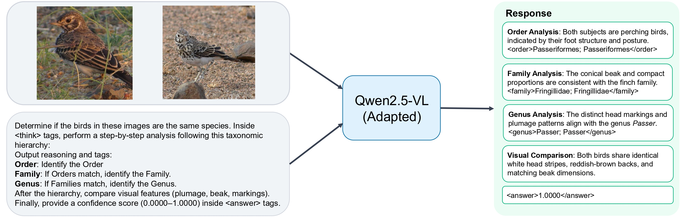

# TaxonRL: Intermediate-Reward RL for Interpretable Fine-Grained Visual Reasoning (WACV 2026)

This repository contains the **reinforcement-learning (GRPO) training pipeline** used in:

> von Klinski, M. and Schall, M. **TaxonRL: Reinforcement Learning with Intermediate Rewards for Interpretable Fine-Grained Visual Reasoning**. WACV 2026.

TaxonRL trains a vision-language model to produce **structured, interpretable reasoning traces** and uses **intermediate rewards** aligned with a **taxonomic hierarchy** (e.g., Order → Family → Genus) to encourage faithful, fine-grained visual reasoning.



## What this repo is

- **This repo is**: a GRPO/RL training framework (Ray + FSDP + vLLM rollouts) plus domain-specific **prompt templates** and **reward functions** for intermediate-reward training.
- **This repo is not**: a complete end-to-end pipeline including supervised fine-tuning (SFT) scripts. In our work, SFT was done using **LlamaFactory** and the resulting checkpoint is then used as the starting point for GRPO.

## Repository structure

This repo follows a simple pattern: _a base config_ + _domain scripts that override it_ + _prompt templates_ + _reward functions_.

### Key directories

- `examples/config.yaml`
  - The **default GRPO configuration** (OmegaConf/Hydra-style) used by all example runs.
  - It sets the model path, rollout parameters, batch sizes, checkpointing policy, and default reward function.
- `examples/<domain>/*.sh`
  - **Copy-pastable launchers** for specific datasets/domains. They all call:

    `python3 -m verl.trainer.main config=examples/config.yaml ...overrides...`

  - The folder name is the “task family” (e.g. `fungi`, `bird`, `sea_star`, `chimp`, `gorilla`, `human`, `whale`).

- `examples/format_prompt/*.jinja`
  - Jinja2 templates that format each sample into a structured instruction.
  - These prompts typically enforce a tagged output format such as:
    - `<think> ... </think>` for reasoning traces
    - task-specific tags inside `<think>` (e.g. `<order>...</order>`, `<family>...</family>`, `<genus>...</genus>`)
    - `<answer> ... </answer>` for the final prediction / confidence score
- `examples/reward_function/*.py`
  - Reward functions used during GRPO. They parse the model output tags and compute:
    - **format reward** (did the output follow the required tagged schema?)
    - **task reward** (e.g., correctness of a probability / label)
    - **intermediate reward** (e.g., correctness of hierarchical taxonomic predictions)
  - Many of these implement a **batch-style** reward function (expects a list of `{"response", "ground_truth", ...}` inputs), matching `worker.reward.reward_type=batch`.
- `verl/`
  - The underlying training implementation (Ray trainer, FSDP sharding, vLLM rollout worker, checkpointing).
- `eval/`
  - Lightweight evaluation utilities (vLLM-based inference scripts).
- `scripts/`
  - Utilities for working with checkpoints (e.g., merging FSDP shards into a Hugging Face checkpoint).

## Notes on credentials and logging

- **Hugging Face**: if you use private models/datasets, run `huggingface-cli login` inside the container.
- **Weights & Biases (W&B)**: this repo can log to W&B when configured. Prefer passing `WANDB_API_KEY` as an env var or mounting a credentials file. Avoid hardcoding keys.

## Quickstart: reproduce fungi intermediate-reward GRPO (6 GPUs)

This section documents the primary reproduction path requested for this repo: the **fungi intermediate-reward** GRPO training run defined in `examples/fungi/fungi_im_6g.sh`.

### 1) Choose the starting model checkpoint

The example scripts default to:

```bash
MODEL_PATH=Qwen/Qwen2.5-VL-7B-Instruct
```

You can also point `MODEL_PATH` to a **local Hugging Face-format directory** (for example, an SFT checkpoint produced by LlamaFactory and exported to HF format).

### 2) Launch training

Inside the main repository, run:

```bash
bash examples/fungi/fungi_im_6g.sh
```

This script runs:

- **Dataset**: `maxvonk/danish-fungi-2024-pairs-800px@train`
- **Prompt template**: `examples/format_prompt/rebuttal_fungi_im_concrete.jinja`
- **Reward function**: `examples/reward_function/lfw_fungi_im.py:compute_score_gemini`
- **GPUs**: `trainer.n_gpus_per_node=6`
- **GRPO sampling**: `worker.rollout.n=16`
- **Batch sizes**: `worker.actor.global_batch_size=48`, `data.rollout_batch_size=48`

### 3) Expected outputs

Checkpoints are written under:

`checkpoints/<project_name>/<experiment_name>/global_step_*/`

Where `<project_name>` and `<experiment_name>` come from the effective config.

For the fungi run in `examples/fungi/fungi_im_6g.sh`:

- `trainer.project_name` defaults to `easy_r1` in `examples/config.yaml`
- `trainer.experiment_name` is overridden to `4.1_fungi_im_6g`

So you should see:

`checkpoints/easy_r1/4.1_fungi_im_6g/global_step_*/actor/`

The `actor/` directory contains sharded FSDP model checkpoints and a `huggingface/` subfolder used for export/merge workflows.

## How the example scripts are organized

Each `examples/<domain>/` folder contains one or more `.sh` scripts that define a _complete experimental run_ by overriding `examples/config.yaml`. The typical pattern is:

- **Baseline script**: uses a generic prompt (often `examples/format_prompt/lfw_format.jinja`) and a simpler reward (`examples/reward_function/lfw.py:compute_score`).
- **Intermediate-reward (TaxonRL) script**: uses a domain-specific prompt template with hierarchical tags and a matching reward function that scores intermediate structure (e.g., taxonomy correctness).

For fungi specifically:

- `examples/fungi/fungi_baseline_6g.sh`
  - Baseline prompt: `examples/format_prompt/lfw_format.jinja`
  - Baseline reward: `examples/reward_function/lfw.py:compute_score`
- `examples/fungi/fungi_im_6g.sh`
  - Intermediate prompt: `examples/format_prompt/rebuttal_fungi_im_concrete.jinja`
  - Intermediate reward: `examples/reward_function/lfw_fungi_im.py:compute_score_gemini`

Other domains follow the same structure (birds, sea stars, chimp/gorilla identity, human face datasets), with domain-specific templates and reward parsers under `examples/format_prompt/` and `examples/reward_function/`.

## Export / merge FSDP checkpoints to Hugging Face format

Training saves **sharded** checkpoints. To export a merged Hugging Face checkpoint, use:

```bash
python scripts/model_merger.py --local_dir checkpoints/easy_r1/4.1_fungi_im_6g/global_step_<N>/actor
```

This produces a merged model under:

`checkpoints/easy_r1/4.1_fungi_im_6g/global_step_<N>/actor/huggingface/`

Optionally, you can upload the merged model to Hugging Face with:

```bash
python scripts/model_merger.py \
  --local_dir checkpoints/easy_r1/4.1_fungi_im_6g/global_step_<N>/actor \
  --hf_upload_path <your_hf_org_or_user>/<your_repo_name>
```

## Framework

- **Training framework base**: this repository is based on **EasyR1** (`hiyouga/EasyR1`), which itself is a clean fork of veRL.
  - Upstream: `https://github.com/hiyouga/EasyR1`
- **Supervised fine-tuning (SFT)**: done with **LlamaFactory** (`hiyouga/LlamaFactory`).
  - Upstream: `https://github.com/hiyouga/LlamaFactory`

## Citation

If you use this code, please cite:

```bibtex
@InProceedings{von_Klinski_2026_WACV,
  author    = {von Klinski, Maximilian and Schall, Maximilian},
  title     = {TaxonRL: Reinforcement Learning with Intermediate Rewards for Interpretable Fine-Grained Visual Reasoning},
  booktitle = {Proceedings of the IEEE/CVF Winter Conference on Applications of Computer Vision (WACV)},
  month     = {March},
  year      = {2026},
  pages     = {2485-2498}
}
```

and for the EASYR1 framework:

```bibtex
@misc{zheng2025easyr1,
  title        = {EasyR1: An Efficient, Scalable, Multi-Modality RL Training Framework},
  author       = {Yaowei Zheng, Junting Lu, Shenzhi Wang, Zhangchi Feng, Dongdong Kuang, Yuwen Xiong, Richong Zhang},
  howpublished = {\url{https://github.com/hiyouga/EasyR1}},
  year         = {2025}
}
```
